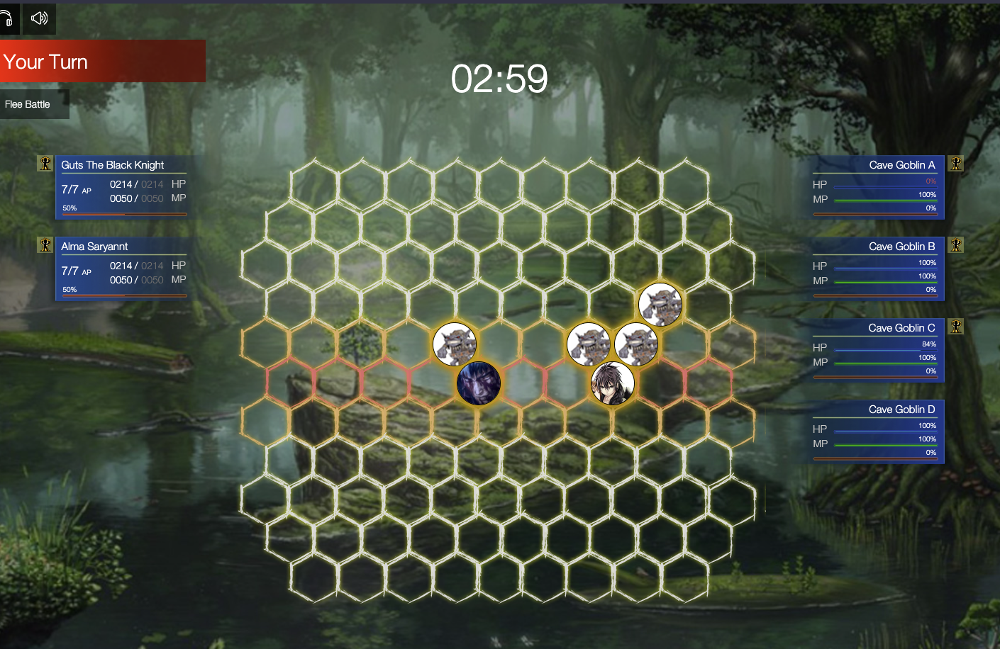

# phynia-js-combat

This is a Javascript based combat system, in a custom made board. It includes enemies AI, range of different techniques, tatical combat using AP and planning, distance and calculations, animations of several different types.

# how to run
copy this project and install the dependencies, and execute:
```
npm i
npm run dev
```

### Credits
This project was created by Leonardo Pereira <contato@leonardopereira.com>

